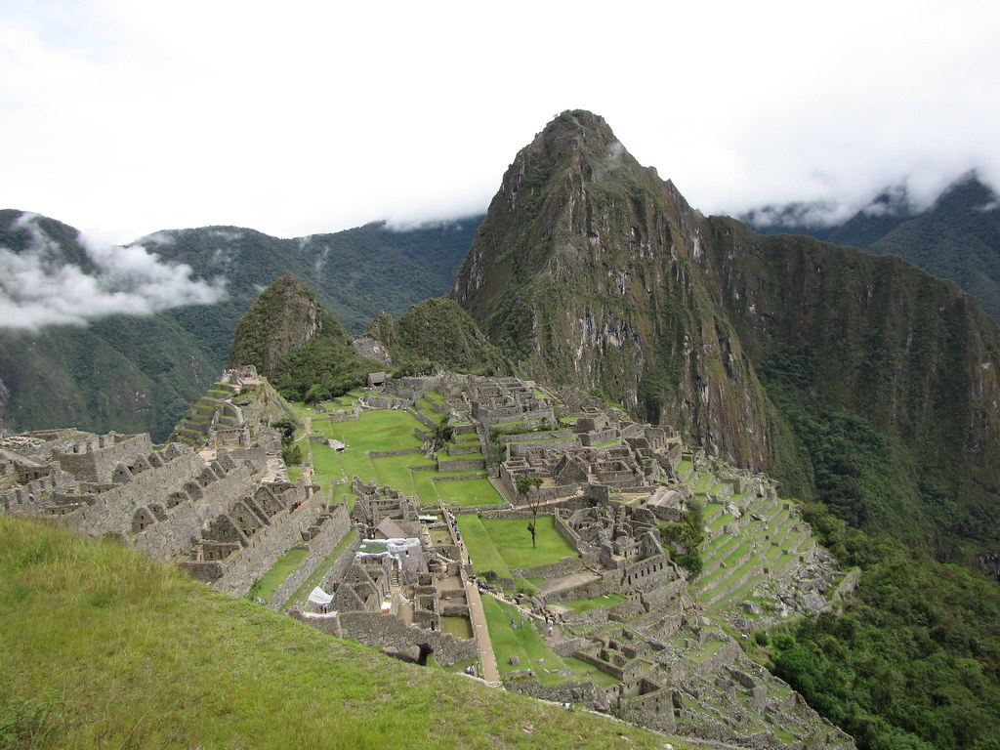

Bueno todo empezó desde el 2014 cuando avianca puso en oferta los tiquetes de San José a Lima,Perú en $200 o algo así la verdad no recuerdo la tarifa pero estaban super barato y bueno mi novio en ese momento ahora mi esposo simplemente se volvió loco y quería que los compraramos, el problema era que en ese momento no estábamos bien financieramente y muchos nos habían comentado que era super costo.

En fin, la idea quedó pero no habíamos visto la oportunidad de hacerlo hasta inicios de este año cuando Latam Airlines puso en promoción su tarifa para Lima en $300 ida y vuelta directo. Entonces después de un rato de pensarlo decidimos que era el momento de cumplir este sueño.

Como dicen en mi país **subidos en la yegua hay que amasarla**, lo cierto es que jamás pensamos en todo lo que teníamos que planear, coordinar y los costos para poder lograr visitar uno de los más increíbles maravillas y patrimonio mundial, si creo que ya saben de que les habló Machupicchu o más bien dicho **Santuario Histórico – Parque Arqueológico Nacional de Machupicchu.**

Bueno, como planeamos hacer otros tour nos vamos a instalar en la ciudad de Cusco y obviamente nuestro primer tour ahí será Machupicchu. Para llegar vamos a subir en bus a Ollantaytambo y de ahí tomaremos el tren hasta Aguas Caliente que es el pueblo más cercano a Machupicchu. En nuestro caso que tenemos un presupuesto limitado compramos el ticket Expedition que tiene un costo de $70 por persona aproximadamente.

Por cierto no les comente, que el primer día nos vamos a hospedar en Ollantaytambo en un precioso lugar que encontramos en **Airbnb** y super cerca de la terminal de tren porque debemos subir a las 4:30am para llegar a las 6:00am a Aguas calientes.

Si no sabes qué es Airbnb, te comento que es una plataforma que brinda hospedajes super baratos y muy bonitos, pueden ser desde cabañas, departamento o un dormitorio entre otros. No tengas miedo en utilizar esta plataforma, es muy fácil y puedes contactarte con anfitrión o dueño del departamento antes de reservar por si tienen dudas. Hace unos días me di cuenta que por invitar amigos con este [link](https://es.airbnb.com/c/fabiolaz156?currency) puedes obtener un bono de hasta **$56** para utilizar en su primera reservación, por lo que se los dejo por si deseas utilizarlo.

Bueno luego de todo esa explicación, creo que les comentaba que el siguiente paso es comprar nuestra entrada al Parque de Machupicchu que debemos adquirir con anterioridad porque tiene cupo limitado de personas, así que ya revise en la página oficial y tienen un costo de 152 PEN, que son aproximadamente $45.

Para nuestro regreso a Cusco, decidimos tomar el tren desde Aguas Calientes hasta Cusco este ticket igual que el anterior es Expedition y tiene un costo de $150 cada uno.

Todavía resta reservar algunos hospedajes y transportes espero pronto estarles contando más sobre esta aventura.

**Continuará…**
