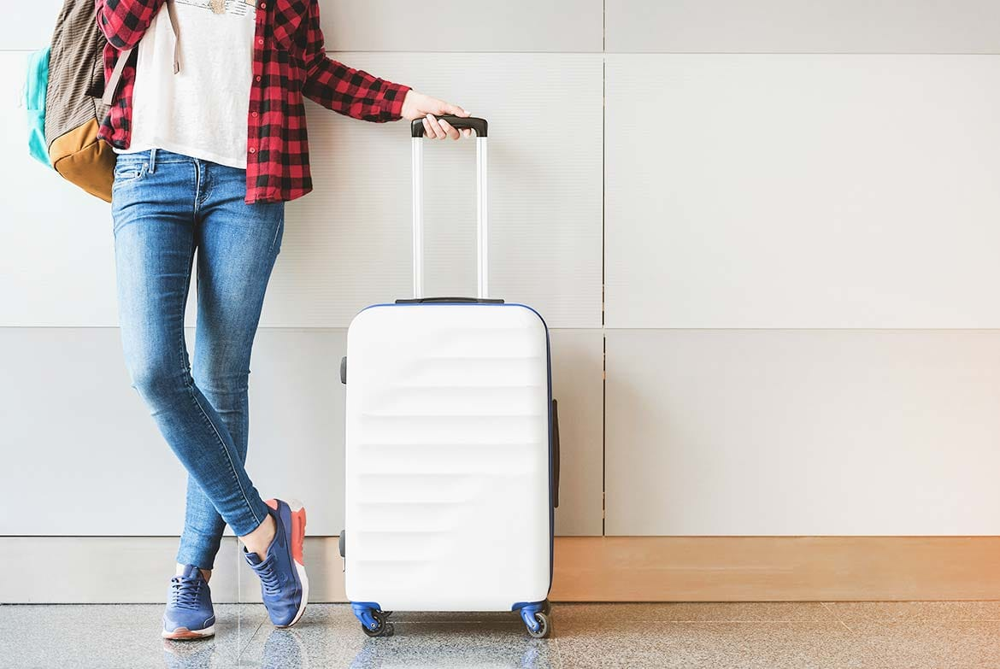

Para todo siempre hay una primera vez y si esta es tu primera vez viajando en Avión a otro país, este blog te servirá para aclarar tus dudas de que debes y no debes portar en tu maleta de mano.

### 1. Artículos prohibidos y restringidos
Es común que por desconocimiento lleves en tu maleta de mano artículos que no puedes portar dentro del avión o aeropuerto y cuando te realicen el escaneo en el puesto migratorio, los funcionarios inmediatamente se darán cuenta y te decomisaran aquello que sea prohibido o restringido en las cantidades que lo piensas llevar. Por lo que te dejo un listado según la página web del aeropuerto Juan Santamaría (https://sjoairport.com/guia-al-pasajero) de cuales son estos articulos:

#### Prohibido:
- Armas de tiro de proyectiles.

- Todo tipo de herramientas.

- Instrumentos contundente.

- Mercancías peligrosas (sustancias inflamables o nocivas).

- Baterías, deberán ser valoradas según cantidad y voltaje.

- Encendedores.

#### Restringidos:
-  Los medicamentos podrán incluirse en el equipaje de mano, siempre y cuando sean sólo para su uso o consumo durante el viaje y con receta médica habilitante a nombre del pasajero tratado.
-  En el caso de la insulina y los inhaladores, personal de seguridad valorará el tiempo de vuelo, y con base en esto determina la cantidad de dosis permitida, por lo general son de 3 a 4 dosis.
-  Aquellos pasajeros con implantes metálicos deberán informar a los oficiales acerca de su condición, para su revisión de forma manual (palpando).

Adicionalmente, según la **NORMATIVA AVSEC-002 (LAGS)** no es permitido los líquidos, cremas, geles de ducha, pastas, bebidas envasadas, alimentos, lociones, fragancias, productos cosméticos, artículos de tocador, y aerosoles que excedan los 100 ml (incluso si el envase no está lleno del todo), por lo tanto el tamaño máximo permitido de envases que contengan líquidos es de 100 ml.

###2. Dimensiones de la maleta de mano
Hoy en día no existe un tamaño ni un peso estándar para el equipaje de mano aceptado por todas las compañías aéreas. Por lo que quise hacer una guía rápida en la que detallamos las medidas del equipaje de mano de la mayoría de aerolíneas que vuelan desde Costa Rica.

| **Aerolínea**    | **Dimensión** | **Peso** |
| :------             | :---  | :----- |
| Spirit           | 45 X 35 X 20 cm | NA |
| Volaris          | 57 x 40 x 33 cm | 10kg |
| Jetblue          | 55.88 x 35.56 x 22.86cm | NA |
| American Airline | Tiene derecho a un artículo personal de (45 x 35 x 20 cm) y una maleta de mano (56 x 36 x 23 cm) | NA |
| Latam | 55 x 35 x 25 cm | 8kg |
| Avianca | 55 x 35 x 25 cm | NA |
| Copa Airline | 56 x 36 x 26 cm | NA |
| Aeromexico | 55x40x25 cm | 10kg |
| United Airline | Tiene derecho a un artículo personal de (22 x 25 x 43 cm) y una maleta de mano (22 x 35 x 56 cm) | NA |
| Southwest | Tiene derecho a un artículo personal de (18.5 x 8.5 x 13.5 pulgadas.) y una maleta de mano (10 x 16 x 24 pulgadas) | NA |
| Alaska | 56 x 35 x 23 cm | NA |
| Delta | 56 x 35 x 23 cm | NA |
| Interjet | 55 x 40 x 25 cm | 10Kg |
| Iberia | Tiene derecho a un artículo personal de (40 x 30 x 15 cm) y una maleta de mano (56 x 45 x 25cm) | NA |
| Air Panama | NA | 4kg |
| Air France | Tiene derecho a un artículo personal de (40 x 30 x 15 cm) y una maleta de mano (55 x 35 x 25 cm) | 12kg entre ambas. |
| Air Canada | Tiene derecho a un artículo personal de (43 x 33 x 16 cm) y una maleta de mano (55 x 40 x 23 cm) | NA |
| British Airways | 56cm x 45cm x 25cm | 23kg |
| Lufthansa | 55 x 40 x 23 cm | 8kg |
| WestJet | Tiene derecho a un artículo personal de (41 x 33 x 15cm) y una maleta de mano (53 x 38 x 23 cm) | NA |
| KLM | Tiene derecho a un artículo personal de (40 x 30 x 15 cm) y una maleta de mano (55 x 35 x 25 cm) | NA |
| Edelweiss | 55 x 40 x 23 cm | 8kg |
| Cubana | La suma de las tres dimensiones ( altura+anchura+profundidad) no debe exceder los 115 cm. | 5kg |
| Albatros | 55 x 35 x 23 cm | 10kg |
| Condor | Tiene derecho a un artículo personal de (40 x 30 x 10 cm) y una maleta de mano (55 x 40 x 20 cm) |   |
| Air transat | 23 x 40 x 51cm | 10kg |

### 3. Que no puedes olvidar

Ahora sabiendo lo que no puedes portar en tu maleta de mano, te voy a brindar algunas recomendación de que no puedes olvidar llevar:

El más importante, es tu pasaporte claramente jamas lo puedes olvidar, el segundo en mi lista sería  un lapicero, ya que siempre necesitarás uno para llenar las formas migratoria, unos audífonos para silenciar el sonido del avión y además distraerte, cámara fotográfica o celular para tus fotografías, un cargador de celular, un abrigo porque por lo general los aviones y aeropuertos suelen ser fríos, snack, chicles para la presión que puedas experimentar a la altura, pastillas tipo acetaminofén o diarrea previendo que pueda tener un malestar repentino, cepillo de dientes y pasta dental de menos de 100 ml.

Espero toda esta información les ayude para que en su primer viaje la experiencia sea la mejor.
