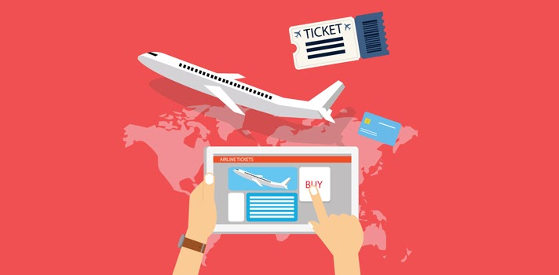
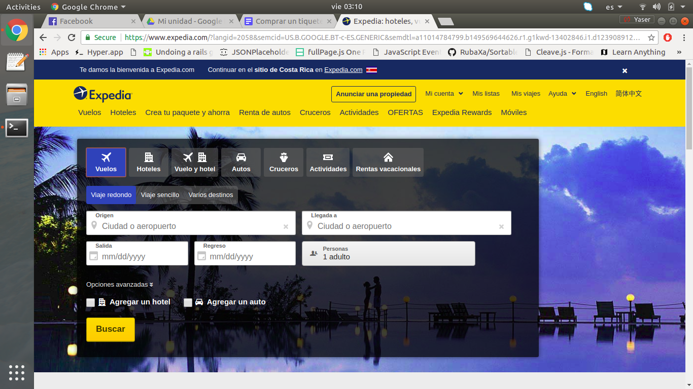

Todas las páginas de compras de tiquetes tienen muchas similitudes con respecto a la información que requerida para realizar una compra, lo que varía es la cantidad de pasos. Por lo que hoy me gustaría explicar paso a paso cómo hacer una compra en Expedia.

#### Paso 1:
Ingresar al link <a href="https://www.expedia.com" target="_blank">**(www.expedia.com)**</a>.

#### Paso 2:
 Luego debes ir a la opción de **“Vuelos”**, ahí debes completar la opción de **Origen, Llegada a, fecha de salida, fecha de regreso y cantidad de personas.** Para finalmente darle clic en el botón de **Buscar**.

#### Paso 3:
Elegir la opción que más se adecue a tus preferencias de precio, aerolínea, escala y horario.

#### Paso 4:
Luego le das clic en la opción de **Seleccionar** y posteriormente **Elegir tarifa**.

#### Paso 5:
Posteriormente en la parte inferior de la página hay botón que dice **Continuar con la reservación**, se le debe dar clic.

#### Paso 6:
Llenar los campos con la información de su pasaporte, tarjeta de crédito, dirección de país y correo electrónico.

#### Paso 7:
Revisar toda la información digitada y finalmente dar clic en el botón de **Completar Reservación.**  Listo, solo verifica en tu correo electrónico que llegue la confirmación de la compra, tarda de 5 a 10 minutos en llegar.

Si la página te genera un error cuando finaliza la compra no realice el proceso de compra nuevamente. Por el contrario, te recomiendo primero verifiques en tu correo electrónico si has recibido la confirmación de compra, posteriormente verificar tu cuenta bancaria que no exista ningún cargo o transaccion flotante. Si te aparece la transacción en tu estado de cuenta pero no recibiste la confirmación de la compra debes ponerte en contacto con Expedia.

Esos fueron los simples pasos para comprar un tiquete en Expedia, así viajeros que a poner esas habilidades en marcha para tener muchas nuevas aventuras.

Desde ya les deseo un buen viaje!

**Atentamente:**
La Asistente Cr
Tú asistente de viaje

