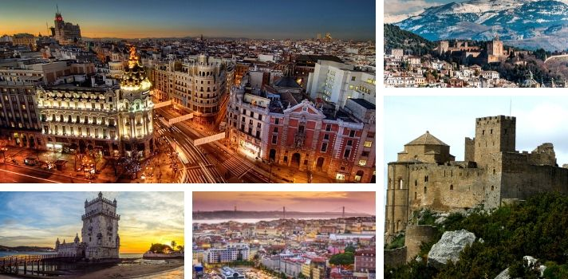

¿Te gusta la aventura y mochilear por el mundo? Bueno este itinerario te parecerá interesante, ya que disfrutarás desde lugares históricos, hermosos paisajes y un poco de playa. Inicia en Lisboa, Portugal para luego llevarnos por majestuosos destinos imperdibles de España.

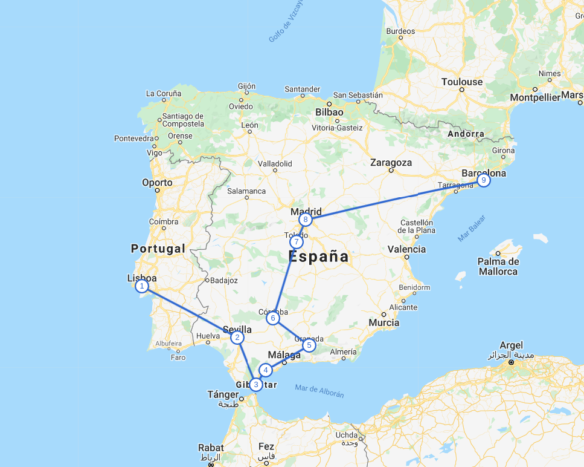

## Día 1 - Lisboa
(1 día) 

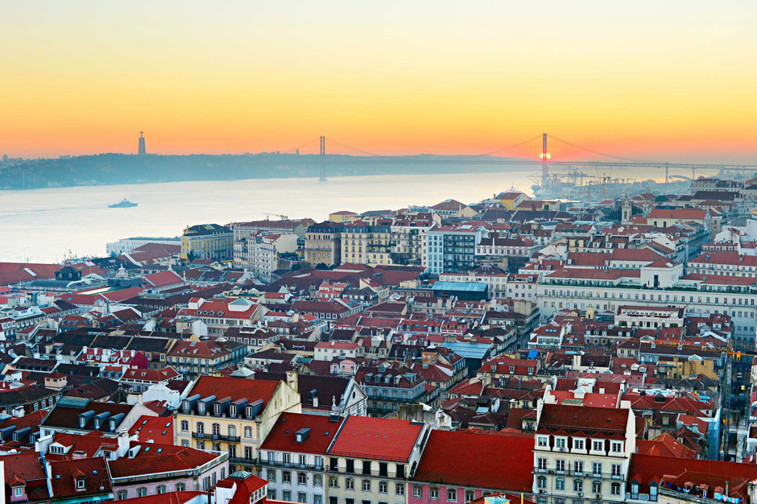

Lisboa es la capital costera y montañosa de Portugal. Desde el imponente castillo de San Jorge, la vista abarca los edificios de colores pastel en la ciudad antigua, el estuario del Tajo y el puente colgante 25 de Abril. Cerca, el Museo Nacional del Azulejo exhibe 5 siglos de azulejos de cerámica decorativos.

**Lugares que puedes visitar:** Torre de Belém, Arco de la Rua Augusta, Catedral de Lisboa, Castillo de San Jorge de Lisboa, Elevador de Santa Justa, Convento do Carmo, Basílica da Estrela, entre otros. 

**Hospedaje:** Costo aproximado por noche para dos personas en un hotel 3 estrellas es de $50 en adelante.

#### Desplazamiento
**Vuelo:** Lisboa~Sevilla  (Costo aproximado: $45) , con una duración de 2.5 horas.

## Día 2 - Sevilla
(1 día)

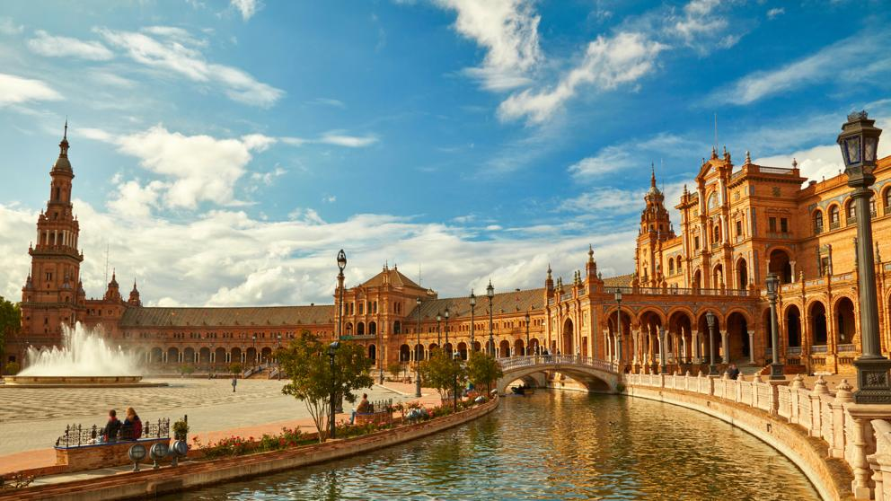

Sevilla es la capital de la región Andalucía, en el sur de España. Es famosa por su danza flamenco, particularmente en su barrio de Triana. Los principales sitios icónicos incluyen el complejo de castillos adornados del Alcázar, construido durante el imperio almohade morisco, y la Plaza de los Toros de la Maestranza, del siglo XVIII.

**Lugares que puedes visitar:** Puente de Isabel II, Plaza de toros de la Real Maestranza de Caballería de Sevilla, Setas de Sevilla, La Giralda, Catedral de Sevilla, Real Alcázar de Sevilla, Archivo de Indias, Torre del Oro, Real Fábrica de Tabacos de Sevilla, Parque de María Luisa, Plaza de España, entre otros.

**Hospedaje:** Costo aproximado por noche para dos personas en un hotel 3 estrellas es de $65 en adelante.

#### Desplazamiento
<a href="https://www.enterprise.com/es/reserve.html#cars" target="_blank">**Rent a Car**</a>: Para los siguientes días debes movilizarte en autobús pero te recomiendo rentar un vehículo, de esta manera optimizamos el tiempo. Costo por un automóvil para 5 pasajeros, por cuatro días es de $170 en adelante.

Sevilla~Gibraltar  tiene una duración de 2 horas.

## Día 3 - Gibraltar

(1 día)

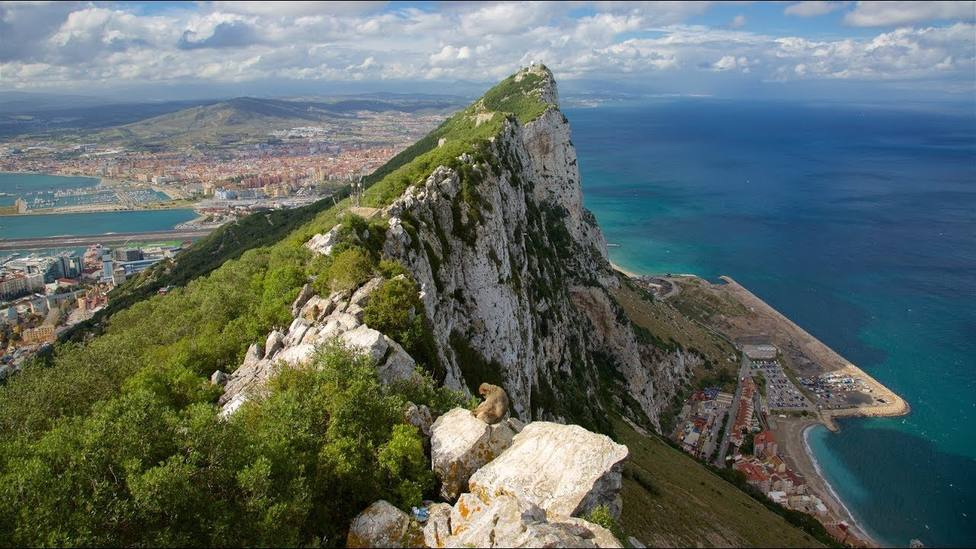

Gibraltar es un promontorio y un territorio británico en ultramar, en la costa sur de España. Está dominado por el Peñón de Gibraltar, una cresta de caliza de 426 m de altura. En este territorio, se establecieron primero los moros en la Edad Media, luego perteneció a España y fue cedido a los británicos en 1713.

**Lugares que puedes visitar:** Cueva de San Miguel, Jardines Botánicos de Gibraltar, Gibraltar Cable Car, Trafalgar Cemetery, Castillo de los Moros, Reserva Natural de la parte superior del Peñón, Mezquita Ibrahim-al-Ibrahim, Faro de Punta Europa, Punta Europa, Peñón de Gibraltar, entre otros.

**Hospedaje:**  Costo aproximado por noche para dos personas en un hotel 4 estrellas es de $70 en adelante.

#### Desplazamiento
Gibraltar~Costa del Sol tiene una duración de 1.5 horas.

## Día 4 - Costa del Sol

(1 día)

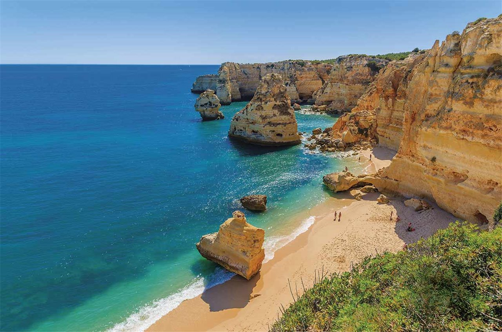

Se conoce como Costa del Sol a la región litoral del sur de la provincia de Málaga, en la región de Andalucía. Está situada al sur de la península ibérica. La Costa del Sol es una de las zonas turísticas más importantes de España, que concentra en torno al 35 % del turismo en Andalucía y que acoge más de 17 millones de pernoctaciones hoteleras anuales, según datos de 2009.​

**Lugares que puedes visitar:** Playa puerto Banús, Tivoli Wolrd, Selwo Marina, Bioparc Fuengirola, Selwo Aventura.

**Hospedaje:**  Costo aproximado por noche para dos personas en un hotel 3 estrellas es de $50 en adelante.

#### Desplazamiento
Costa del Sol~Granada tiene una duración de 2.5 horas. 

## Día 5 - Granada 

(1 día)

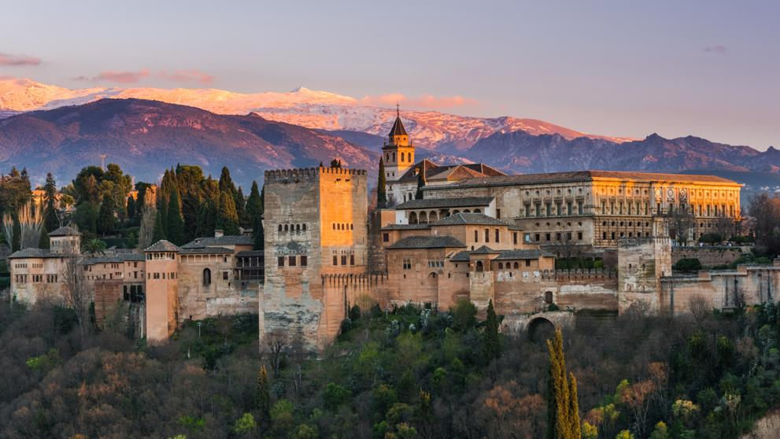

Granada es una ciudad en la región de Andalucía en el sur de España, en la ladera de las montañas de la Sierra Nevada. Es famosa por sus grandes ejemplos de arquitectura medieval que datan de la ocupación de los moros, en particular, la Alhambra.

**Lugares que puedes visitar:** Alhambra, Generalife, Patio de la Acequia, Mirador San Nicolás, El Bañuelo, Carrera del Darro, Restaurante Torres Bermejas,  Catedral de Granada, Capilla Real de Granada, Corral del Carbón, Patio de Los Leones, Palacios Nazaríes, Palacio de Carlos V, Monasterio de Nuestra Señora de la Asunción "La Cartuja", Real Monasterio de San Jerónimo, Catedral de Granada, Plaza Isabel la Católica, entre otros.

**Hospedaje:**  Costo aproximado por noche para dos personas en un hotel 3 estrellas es de $49 en adelante.
 
#### Desplazamiento
Granada~Córdoba tiene una duración de 2 horas.

## Día 6 - Córdoba 

(1 día)

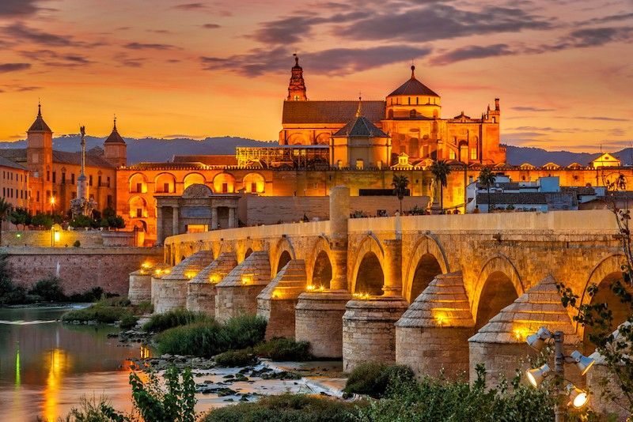

Córdoba es una ciudad del sur de la región de Andalucía, en España, y es la capital de la provincia de Córdoba. Fue una importante ciudad romana y uno de los principales centros islámicos de la Edad Media. Es conocida por la enorme Mezquita que data del año 784 d. C., con un salón de oración con columnas y antiguos mosaicos bizantinos.

**Lugares que puedes visitar:**  Medina Azahara - Conjunto Arqueológico Madinat al-Zahra, Torre de la Calahorra, Puente Romano de Córdoba, Alcázar de los Reyes Cristianos, Sinagoga de Córdoba, Mezquita-catedral de Córdoba, Calleja de las Flores, Palacio de los Páez de Castillejos, Templo Romano, Palacio de Viana, entre otros.

**Hospedaje:**  Costo aproximado por noche para dos personas en un hotel 3 estrellas es de $30 en adelante.

Nota: Aquí entregamos el vehículo para continuar el viaje en tren hacia nuestro siguiente destino.

#### Desplazamiento
Tren: Cordoba~Toledo(Costo aproximado: $45 en adelante), con una duración de 2.5 horas.

## Día 7 - Toledo 

(1 día)

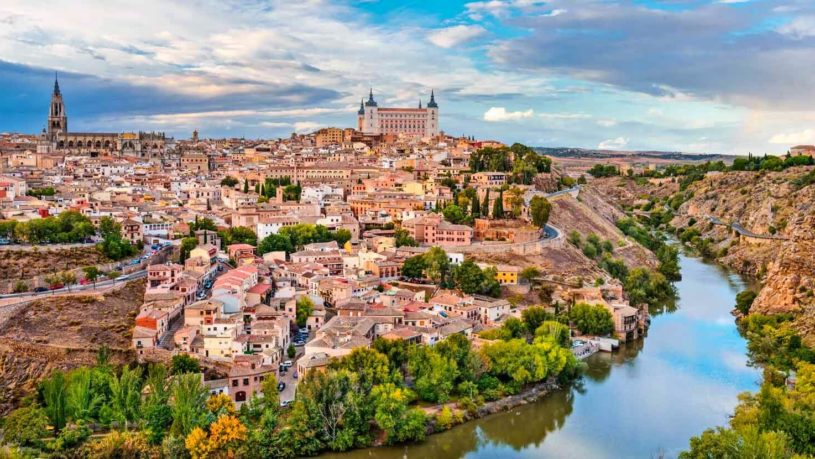

Toledo es una antigua ciudad ubicada en una colina sobre las llanuras de Castilla-La Mancha, en España central. Es la capital de la región y es conocida por los monumentos medievales árabes, judíos y cristianos en su ciudad antigua amurallada. También fue la antigua casa del pintor manierista El Greco.

**Lugares que puedes visitar:** Sinagoga del Tránsito, Sinagoga de Santa María La Blanca, Monasterio de San Juan de los Reyes, Puente San Martín, Museo del Greco, Senda Ecológica de Toledo, Santa Iglesia Catedral Primada de Toledo, Alcázar de Toledo, Puerta Nueva de Bisagra, Puente de Alcántara, Albergue Castillo San Servando,  entre otros.

**Hospedaje:**  Costo aproximado por noche para dos personas en un hotel 3 estrellas es de $35 en adelante.

#### Desplazamiento
Tren:Toledo~Madrid  (Costo aproximado: $17 en adelante), con una duración de 35 minutos.

## Día 8 - Madrid

(1 día)

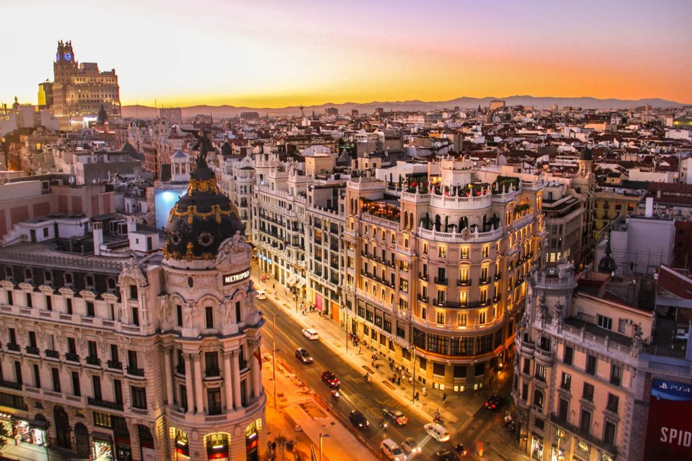

Madrid es la capital central de España con elegantes bulevares y amplios parques muy cuidados, como el Buen Retiro. Es famosa por sus ricas colecciones de arte europeo, con obras de Goya, Velázquez y otros maestros españoles en el Museo del Prado.

**Lugares que puedes visitar:** Puerta del Sol, Plaza Mayor, Mercado de San Miguel, Plaza de Oriente, Templo de Debod, Palacio Real de Madrid, Catedral de la Almudena de Madrid, Museo Nacional del Prado, Parque de El Retiro, Puerta de Alcalá,  entre otros.

**Hospedaje:**  Costo aproximado por noche para dos personas en un hotel 3 estrellas es de $45 en adelante.

#### Desplazamiento
Tren:Madrid~Barcelona  (Costo aproximado: $45 en adelante), con una duración de 3h.

## Día 9 - Barcelona

(2 días)

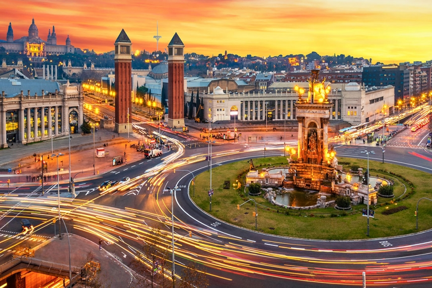

Barcelona, la capital cosmopolita de la región de Cataluña en España, es conocida por su arte y arquitectura. La fantástica iglesia de la Sagrada Familia y otros hitos modernistas diseñados por Antoni Gaudí adornan la ciudad. El Museo Picasso y la Fundación Joan Miró muestran el arte moderno de los artistas que dan origen a sus nombres.

**Lugares que puedes visitar:** Basílica de la Sagrada Família, La Pedrera-Casa Milà, Casa Batlló, La Rambla,  Plaza de España, Camp Nou, Park Güell, Plaza de San Jaime, Catedral de Barcelona, Museo Federico Marés, Salón del Tinell, Basilica de los Santos Martires Justo y Pastor, Sinagoga Mayor de Barcelona, Plaza de Cataluña,  Fundación Antoni Tàpies, Jardín Botánico de Barcelona, Museo Nacional de Arte de Cataluña, entre otros.

**Hospedaje:**  Costo aproximado por noche para dos personas en un hotel 3 estrellas es de $49 en adelante.

Desde ya les deseo un buen viaje!

**Atentamente:**
 
La Asistente Cr
 
Tú asistente de viaje

Fuente: Explorador de viajes de google.

