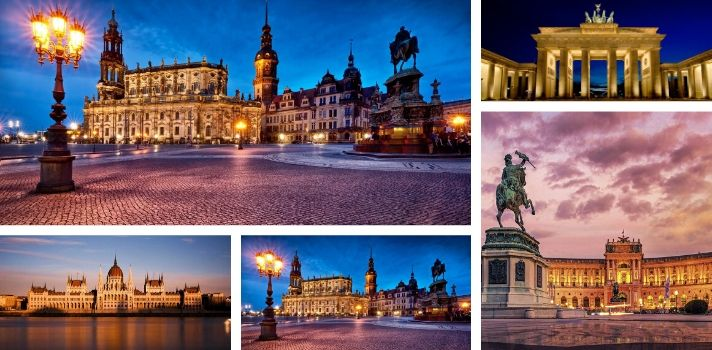
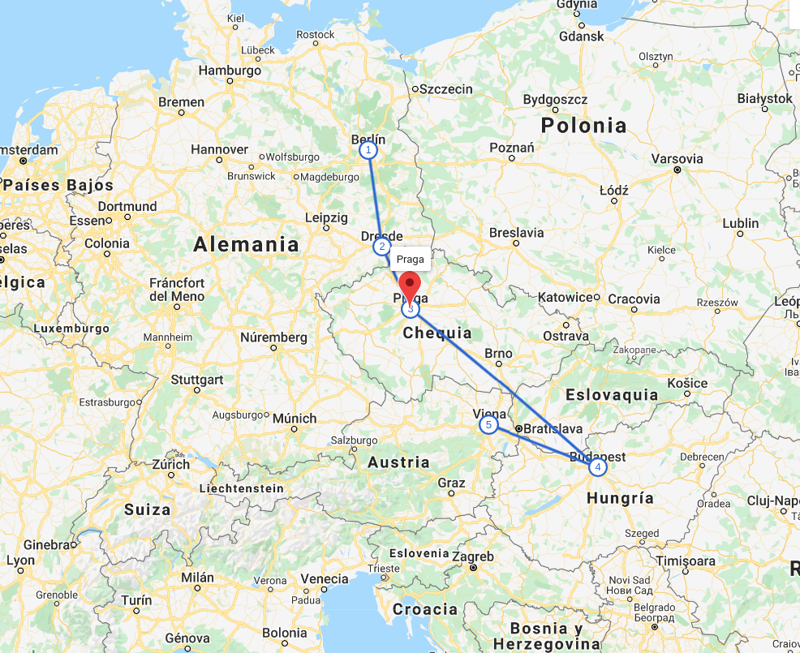
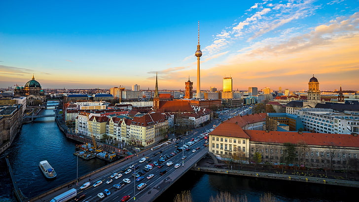
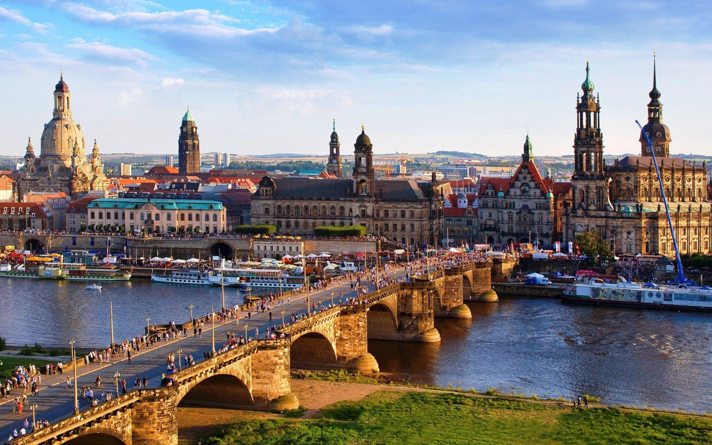
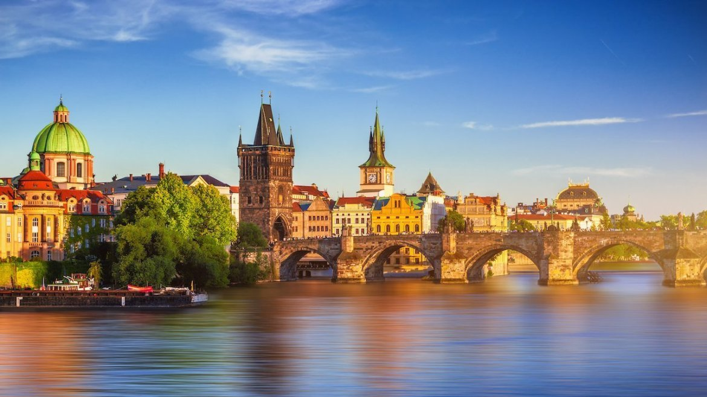
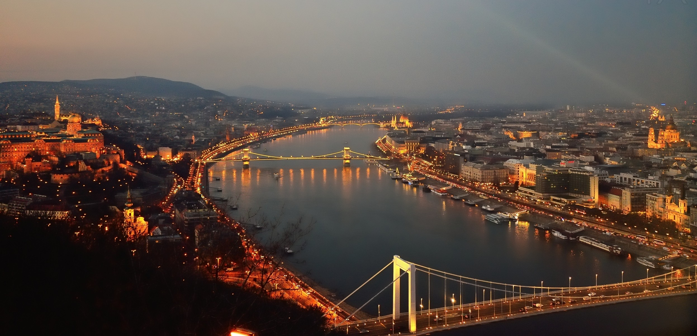
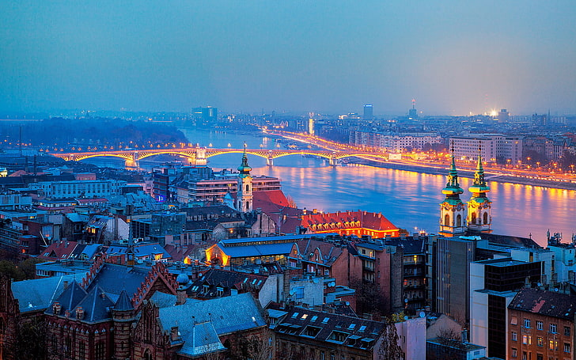

 

¿Te gusta la aventura y mochilear por el mundo? Bueno este itinerario esta increible para viajar por increibles lugares llenos de historia y arqutectura antigua. Inicia en Alemania, continúa por República Checa, hungría y concluye en Austria.

**Mapa de la Ruta**

# Día 1 y 2 - Berlín, Alemania

Berlín, capital alemana, data del siglo XIII. Los elementos que recuerdan la turbulenta historia de la ciudad en el siglo XX incluyen el Monumento del Holocausto y los restos del Muro de Berlín con grafitis. Después de dividirse durante la Guerra Fría, la Puerta de Brandeburgo del siglo XVIII se convirtió en un símbolo de la reunificación.

**Lugares que puedes visitar:** East Side Gallery, Alexanderplatz, Fernsehturm de Berlín, Isla de los Museos, Catedral de Berlín (Berliner Dom), Edificio del Reichstag, Puerta de Brandeburgo, Monumento a los judíos de Europa asesinados, Potsdamer Platz, Checkpoint Charlie, Gendarmenmarkt, Museo de Pérgamo, St. Nicholas' Church Museum, Palacio de Bellevue, Columna de la victoria, Nueva Sinagoga, Hamburger Bahnhof - Museum für Gegenwart - Berlin, entre otros. 

**Hospedaje:** Costo aproximado por noche para dos personas en un hotel 3 estrellas es de $40 en adelante.

**Desplazamiento:** de Berlín a Dresde.
 🚌 Autobús: El costo es de  $6.69 en adelante, con una duración de 3 horas.

# Día 3 y 4 - Dresde, Alemania

Dresde es la capital del estado de Sajonia, en el este de Alemania, y se caracteriza por sus célebres museos de arte y la arquitectura clásica de su ciudad antigua reconstruida. La iglesia barroca Frauenkirche, famosa por su gran cúpula, se completó en 1743 y se reconstruyó después de la Segunda Guerra Mundial.

**Lugares que puedes visitar:**  Puente de Augusto, Hofkirche, Alte Meister, Palacio de Dresde, Holy Cross Church, Dresden City Museum, Frauenkirche, Terraza de Brühl, Castillo de Moritzburg, Secundogenitur, Zwinger, Grünes Gewölbe, Palacio japonés, Golden Rider, entre otros.

**Hospedaje:** Costo aproximado por noche para dos personas en un hotel 3 estrellas es de $66 en adelante.

**Desplazamiento:** de Dresde a Praga 
 🚌 Autobús: El costo es de $23 en adelante, con una duración de 2.5 horas.
 🚄 Tren: El costo es de  $36 en adelante, con una duración de 2.5 horas.

## Día 5 y 6 - Praga, República Checa

Praga, la capital de la República Checa, está dividida por el río Moldava. Recibe el apodo de la “Ciudad de las Cien Torres” y es conocida por la Plaza de la Ciudad Vieja, el núcleo de su centro histórico, con coloridos edificios barrocos, iglesias góticas y el Reloj Astronómico medieval, que muestra un espectáculo animado cada hora.

**Lugares que puedes visitar:** Castillo de Praga, Rudolfinum, Pinkas Synagogue, Klausen synagogue, Sinagoga Española, Jewish Museum in Prague, Antiguo Cementerio Judío, Catedral de Praga, Reloj Astronómico de Praga, Petřínská rozhledna, Puente Carlos, Plaza de la Ciudad Vieja, Torre de la Pólvora, Plaza de Wenceslao, Casa Danzante, entre otros.

**Hospedaje:**  Costo aproximado por noche para dos personas en un hotel 3 estrellas es de $36 en adelante.

**Desplazamiento:** de Praga a Budapest 
 🛫 Avión: El costo es de  $29 en adelante, con una duración de 1.10 horas.

## Día 7 y 8 - Budapest, Hungría

Budapest es la capital de Hungría, por la que cruza el río Danubio. Su Puente de las Cadenas del siglo XIX conecta el distrito montañoso de Buda con la plana Pest. Un funicular asciende al Cerro del Castillo en la Ciudad Vieja de Buda, donde el Museo de Historia de Budapest recorre la vida de la ciudad desde los tiempos del Imperio romano.

**Lugares que puedes visitar:** Iglesia de Matías, Bastión de los pescadores, Castillo de Buda, Piedra del Kilómetro 0, Puente de las Cadenas, parlamento, Basílica de San Esteban, Avenida Andrássy, Plaza de los Héroes, Iglesia Parroquial de la Asunción de la Virgen, Petofi Museum of Literature, Károlyi Garden, Museo Nacional Húngaro, Puente de Szabadsag, entre otros.

**Hospedaje:**  Costo aproximado por noche para dos personas en un hotel 3 estrellas es de $36 en adelante.

**Desplazamiento:** de Budapest a Viena
 🚌 Autobús: El costo es de $10.18 en adelante, con una duración de 3 horas.
 🚄 Tren: Costo es de  $22.53 en adelante, con una duración de 2:38 horas.

## Día 9 y 10 - Viena, Austria

Viena, la capital de Austria, se encuentra en la zona este del país en el río Danubio. Su legado artístico e intelectual se formó gracias a sus residentes, incluidos Mozart, Beethoven y Sigmund Freud. La ciudad también es conocida por sus palacios imperiales, incluido el Schönbrunn, la residencia de verano de los Habsburgo.

**Lugares que puedes visitar:** Palacio de Schönbrunn, Iglesia De San Carlos Borromeo, Palacio Belvedere, Palacio imperial de Hofburg, Catedral de San Esteban de Viena, Prater, Schatzkammer, Museo de Artes Aplicadas, Iglesia De San Carlos Borromeo, Burggarten,  Museo de Historia del Arte de Viena, Wien Museum Otto Wagner Hofpavillion Hietzing, Musikverein, entre otros.

**Hospedaje:**  Costo aproximado por noche para dos personas en un hotel 3 estrellas es de $38 en adelante.

Así concluye esta aventura, espero les guste y compartan con todos sus amigos y familiares este artículo. Si quieres siempre estar al tanto de toda esta información de viaje no olvides suscribirte y seguirnos en nuestras redes sociales como <a href="https://www.facebook.com/laasistentecr/" target="_blank">**La Asistentecr**</a>. 

Desde ya les deseo un buen viaje!

**Atentamente:**
 
La Asistente Cr 
 
Tú asistente de viaje

Fuente: Explorador de viajes de google.

