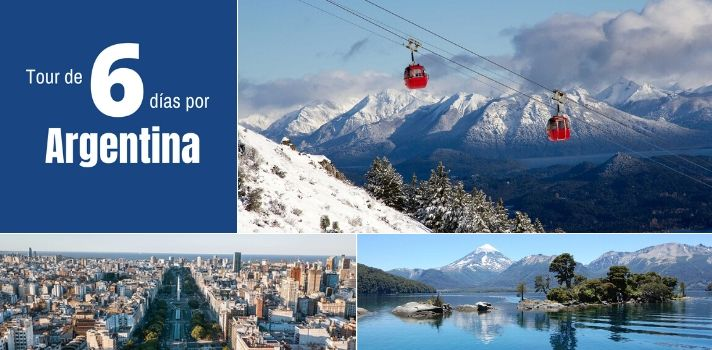
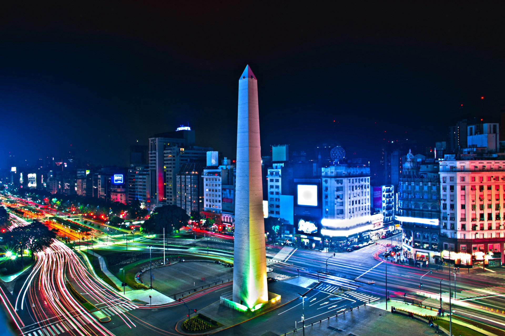
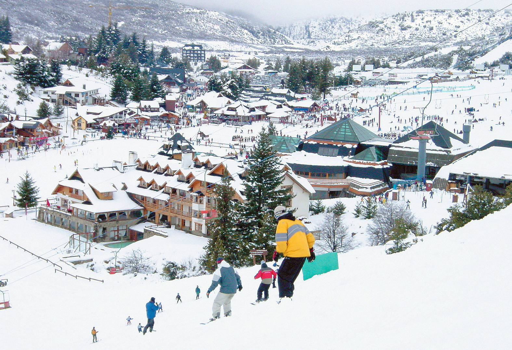
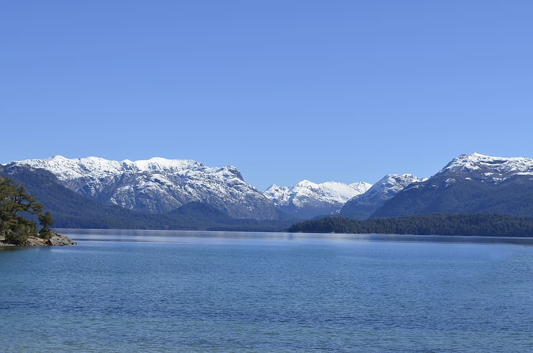

 

¿Te gusta la aventura y mochilear por el mundo? Bueno este itinerario te parecerá interesante, ya que disfrutarás de una variedad de actividades, naturaleza y gastronomía.

# Día 1  - Buenos Aires

Buenos Aires es la gran capital cosmopolita de Argentina. Su centro es la Plaza de Mayo, rodeada de imponentes edificios del siglo XIX, incluida la Casa Rosada, el icónico palacio presidencial que tiene varios balcones.

**Lugares que puedes visitar:** Floralis Genérica, Cementerio de la Recoleta, El Ateneo Grand Splendid, Edificio Plaza San Martín, Obelisco, Catedral Metropolitana, Plaza de Mayo, Casa Rosada, Puente de La Mujer, entre otros. 

**Hospedaje:** Costo aproximado por noche para dos personas en un hotel 3 estrellas es de $20 en adelante.

**Desplazamiento:** de Buenos Aires a San Carlos de Bariloche.
 🛫 Avión: El costo es de  $42 en adelante, con una duración de 3:30 horas.

# Día 2, 3 y 4 - San Carlos de Bariloche

San Carlos de Bariloche (comúnmente llamada Bariloche) es una ciudad en la región de la Patagonia argentina. Limita con Nahuel Huapi, un gran lago glacial rodeado de montañas de los Andes. Bariloche es conocida por su arquitectura al estilo alpino de Suiza y su chocolate, que se vende en tiendas de la calle Mitre, la avenida principal.

**Lugares que puedes visitar:** Catedral Alta Patagonia, Parque Nacional Nahuel Huapi, Cerro Otto, Museo de la Patagonia, Centro Cívico Bariloche, Parroquia San Eduardo, Cerro Llao Llao - Punto Panorámico,  entre otros.

**Hospedaje:** Costo aproximado por noche para dos personas en un hotel 3 estrellas es de $52 en adelante.

**Desplazamiento:** de San Carlos de Bariloche a San Martín de los Andes.
 🚗 Vehículo: El costo es de  $150 en adelante por 4 días, con una duración de 3 horas. <a href="https://www.kayak.com/cars/BRC-a54322/2020-09-07-9h/2020-09-10?sort=rank_a" target="_blank">**Pagina para rentar un carro**</a>.
 🚌 Autobús: El costo es de  $10 en adelante, con una duración de 3:40 horas.

## Día 5 y 6 - San Martín de los Andes

San Martín de los Andes es una ciudad en el noroeste de la Patagonia, Argentina. Es conocida como la vía de acceso al boscoso Parque Nacional Lanín, que alberga el volcán Lanín y una fauna variada que incluye guanacos y pumas. La ciudad se ubica en las orillas del lago Lácar, uno de los muchos lagos glaciares del parque, y tiene un muelle y una playa con arena.

**Lugares que puedes visitar:** Parque Nacional Lanin, Chapelco, Lago Lácar, Volcán Lanín, Mirador Bandurrias - San Martin De Los Andes, Mirador Bandurrias, La Pastera Museo del Che, Plaza Sarmiento, Playa Quila Quina, entre otros.

**Hospedaje:**  Costo aproximado por noche para dos personas en un hotel 3 estrellas es de $51 en adelante.

**Desplazamiento:** de San Martín de los Andes a San Carlos de Bariloche.

Así concluye esta aventura, espero les guste y compartan con todos sus amigos y familiares este artículo. Si quieres siempre estar al tanto de toda esta información de viaje no olvides suscribirte y seguirnos en nuestras redes sociales como <a href="https://www.facebook.com/laasistentecr/" target="_blank">**La Asistentecr**</a>. 

Desde ya les deseo un buen viaje!

**Atentamente:**
 
La Asistente Cr 
 
Tú asistente de viaje

Fuente: Explorador de viajes de google.

