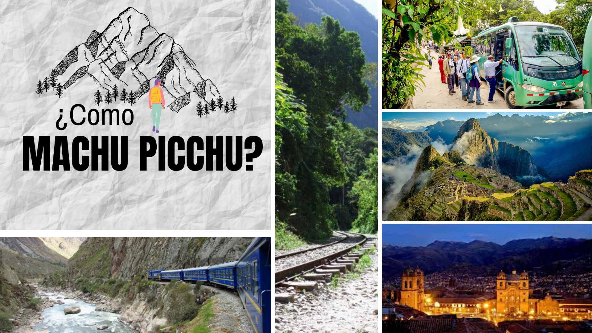
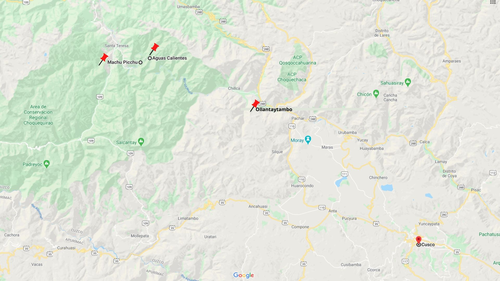
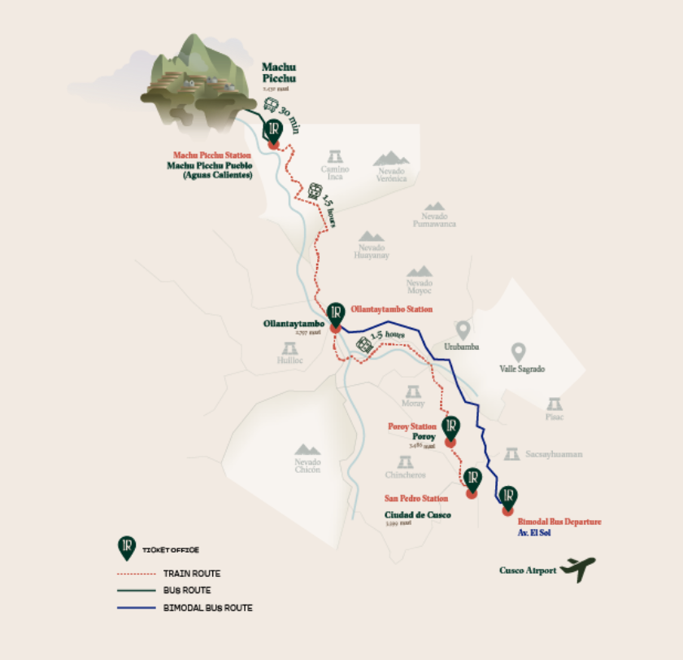
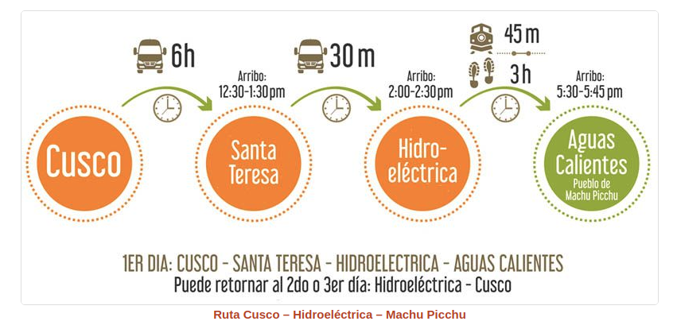
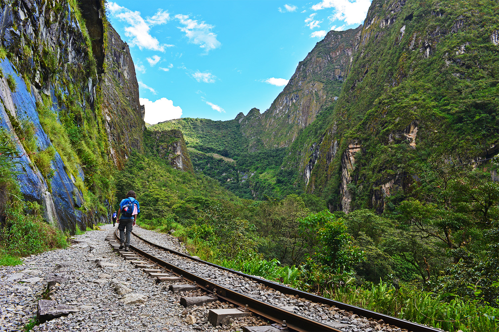
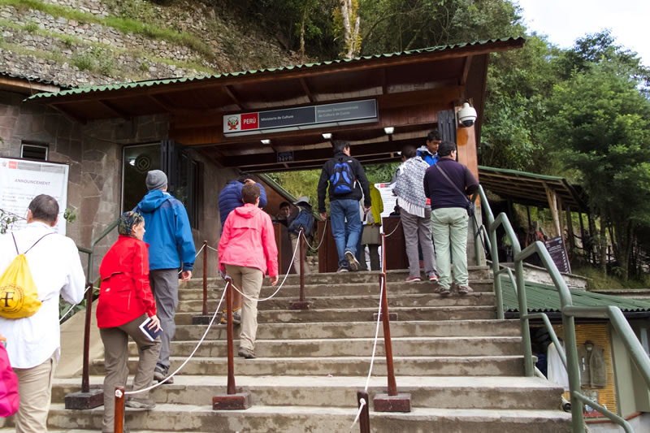

 

Que es ir a Perú y no poder visitar Machu Picchu, sinceramente es como no ir a Perú,  ¿verdad? Por eso voy a tratar de explicar de la mejor manera las opciones que se tienen para visitar este majestuoso patrimonio de la humanidad, para esto vamos a enfocarnos en lo medios de transportes o maneras que tenemos para llegar.

## Recomendaciones iniciales
 Lo primero que deben tener en cuenta es que Machu picchu se encuentra a una altura de 3.499 msnm, muchas personas se lo toman a la ligera y sufren el mal de altura. 
   **¿Que es mal de altura?**
  *Es un malestar físico ocasionado por la dificultad para adaptarse a la baja presión del oxígeno a gran altitud. La mayoría de los casos de mal de altura son moderados, pero algunos pueden ser mortales. Los síntomas son dolor de cabeza, náuseas, dificultad para respirar y, además, imposibilidad para hacer actividad física. Los casos leves se resuelven entre uno y tres días. Los casos graves pueden requerir oxígeno, medicamentos y traslado a una altitud menor.*

Sabiendo esto es importante que tomes las previsiones necesarias. Lo primero es aclimatar tu cuerpo a la altura, lo ideal es quedarse en Cusco por lo menos un día antes de subir. Adicionalmente, es súper importante hidratarte bastante y tomar té de coca; otras opciones son pastillas para el mal de altura o confites y chicles con coca. 

Hasta aquí las recomendaciones, ahora vamos a lo importante **¿Cómo llegar hasta Machu picchu?** Posiblemente si has estado investigado sobre  Machu Picchu, has escuchado de estas tres ciudades Cusco, Aguas Calientes y Ollantaytambo; sin embargo, no tienes claro cual está primero o como moverse de una a otra. ¡Es simple! El orden de la ruta para llegar al Machu Picchu es: **Cusco ➡️ Ollantaytambo ➡️ Aguas calientes ➡️ Machu Picchu.**

## Rutas 

**<ins>De Cusco a Ollantaytambo</ins>**
 La única manera (de forma independiente) para llegar a Ollantaytambo es tomar un autobús con un costo de $17 y con una duración de 1 h 20 min. Seguramente se preguntaran porque dice que es la única forma, si también hay servicio de tren. Revisando las páginas de las compañías de tren, parece que han eliminado el servicio para comprar un tiquete que los lleve únicamente de Cusco a Ollantaytambo, es decir solo aplica si compras desde Cusco hasta Aguas Calientes. 

<ins>**De Ollantaytambo a Aguas Calientes</ins>**
 Cuando ya estes en la ciudad de Ollantaytambo dispondrás de dos opciones. La primera opción es tomar el tren desde la estación de Ollantaytambo o Urubamba y tiene una duración de 1 h 30 min y 02 h 30 min respectivamente. Los costos son variables e inician desde $54. Por lo que te recomiendo planear con al menos unos 6 meses de anticipación para que no pagues de más y puedas elegir el mejor horario para tu visita. La segunda opción es caminando por una ruta que se llama Hidroeléctrica, lo puedes hacer por tu cuenta pero es recomendable ir con un guía, ya que ellos conocen la zona. La caminata tiene una  duración de 2 a 3 horas y el costo aproximado es de $10. También esta ruta la ofrecen como tour, donde te brinda el servicio de transporte y guia turista saliendo desde Cusco hasta Aguas Calientes por un costo de $20.

**<ins>De Cusco a Aguas Calientes</ins>**
 Está opción se podría decir que es la más fácil porque te lleva directo a Aguas Calientes, pero al mismo tiempo la más costosa también. Las dos compañías de tren PERURAIL e INCARAIL te ofrece un servicio de tren saliendo de la Estación de Poroy o San Pedro hasta Aguas Calientes con una parada en Ollantaytambo. La otra opción más económica llamada Bimodal, consiste en una combinación de bus y tren. El primer tracto entre Cusco a Ollantaytambo se realiza en bus/buseta y el segundo tracto se realiza en tren desde la estación de Ollantaytambo o Urubamba a la ciudad de Aguas Caliente.

Nota: Tomar en cuenta que la estación de Poroy está a unos 30 minutos de la ciudad de Cusco.

**<ins>De Aguas Calientes a Machu Picchu</ins>**
 Las dos únicas formas válidas para llegar a Machu Picchu son en bus o a pie por la carretera Hiram Bingham. Lastimosamente, el servicio de transporte es un monopolio de la compañia  <a href="http://consettur.com/">**CONSETTUR**</a> por lo que precio del tiquete tiene un costo de $24 adultos y $12 niños (ida y vuelta), con una duración de 25 min. Puedes comprar tu tiquete en la página oficial    <a href="http://consettur.com/reservas/">**AQUÍ**</a>. La otra opción es subir caminando por la carretera Hiram Bingham esto te tomará 1 hora aproximadamente.

## **Servicios de Tren**
🚈 INCARAIL:   <a href="https://incarail.com/">**Página oficial para reservar**</a>.   🚈 PERURAIL: <a href="https://www.perurail.com/">**Página oficial para reservar**</a>.  
  _**Duración aproximadas:**_
  ▪️ San Pedro (Cusco) – Machu Picchu: 03 h 50 min
  ▪️ Poroy (Cusco) – Machu Picchu: 03 h 30 min
  ▪️ Ollantaytambo – Machu Picchu: 01 h 30 min
  ▪️ Urubamba – Machu Picchu: 02 h 30 min

## **Entrada a Machu Picchu**
Finalmente, para ingresar debes hacer con anterioridad la compra de la entrada al parque del Machu Picchu, tiene un costo de 152 soles un aproximado de 45 dólares americanos.  Además, solo tienes medio día para estar dentro del parque, el primer periodo es de las 6am a las 12pm y el siguiente de las 12pm a las 6pm. Es por esto la importancia de que compres con anterioridad las entradas, para que puedas elegir las primeras horas y poder disfrutar más tiempo dentro del parque. Le dejo la pagina oficial del gobierno de Perú donde puedes hacer la <a href="https://www.machupicchu.gob.pe/inicio" target="_blank">**Reserva tu entrada**</a>. 

Espero haber explicado las opciones posibles para llegar al Machu Picchu de la manera más sencilla. Si te ha gustado este articulo compartelo con todos sus amigos y familiares. Si quieres siempre estar al tanto de toda esta información de viaje no olvides suscribirte y seguirnos en nuestras redes sociales como <a href="https://www.facebook.com/laasistentecr/" target="_blank">**La Asistentecr**</a>. 

Desde ya les deseo un buen viaje!

**Atentamente:**
 
La Asistente Cr 
 
Tú asistente de viaje

Fuente: Explorador de viajes de google.

