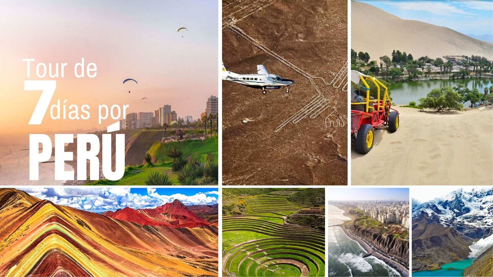
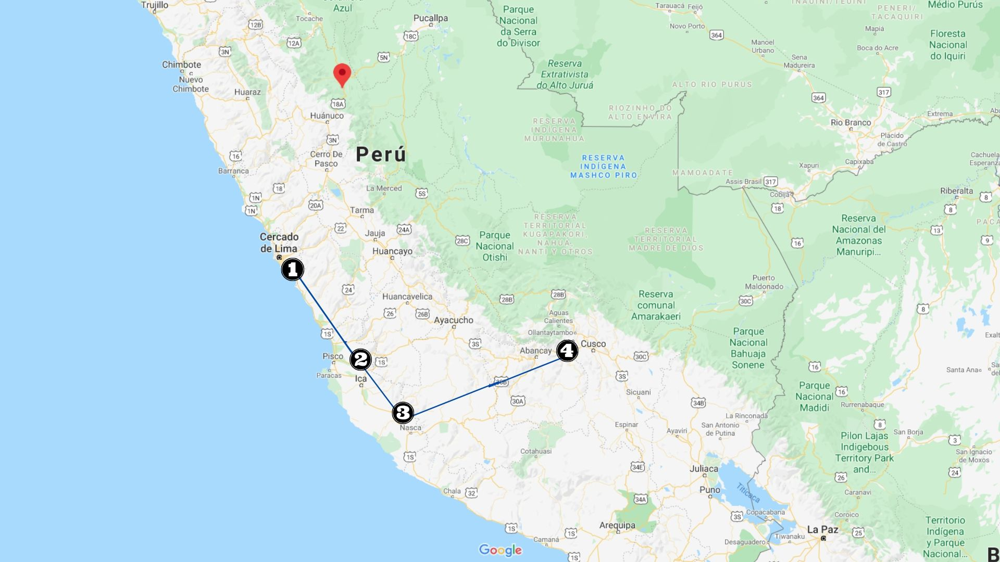
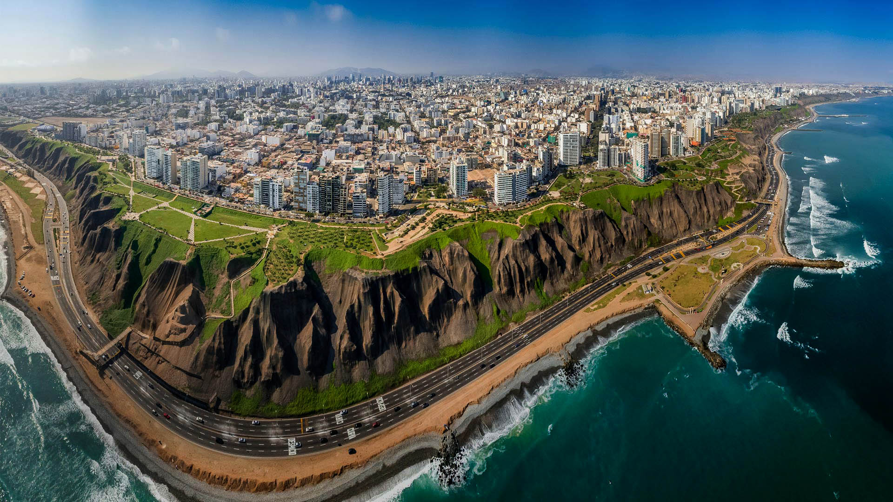
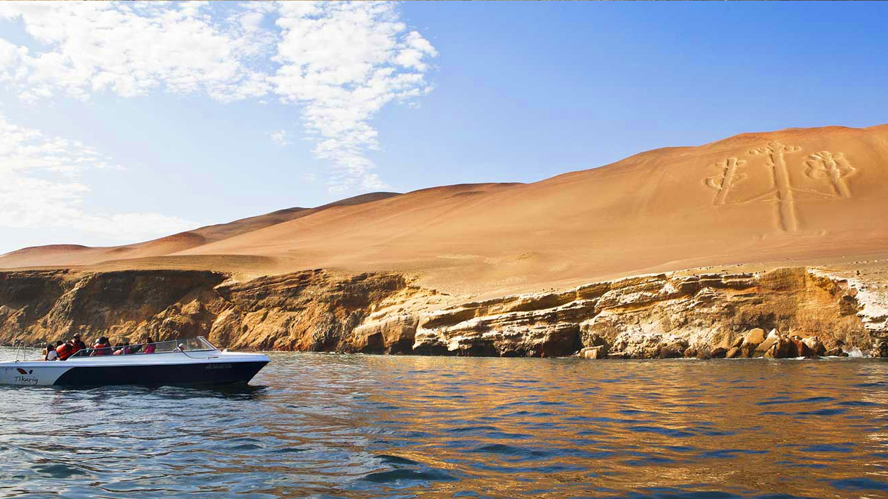
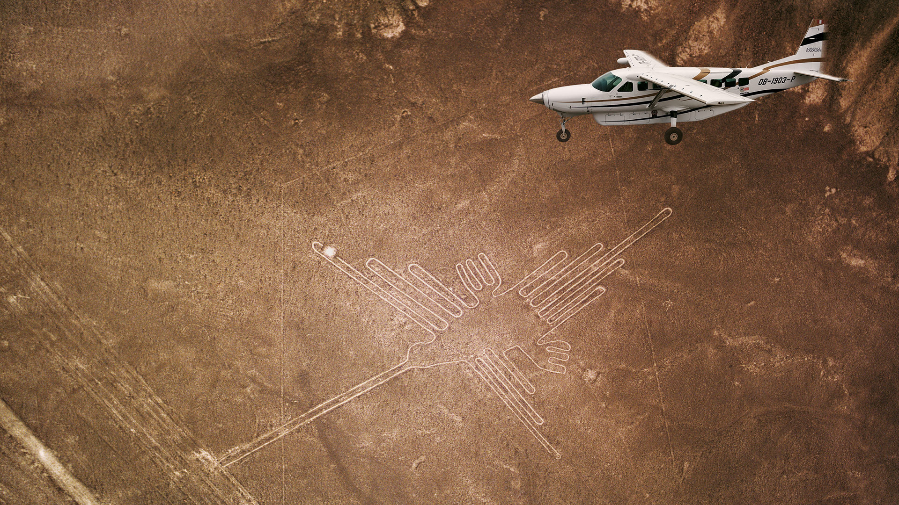
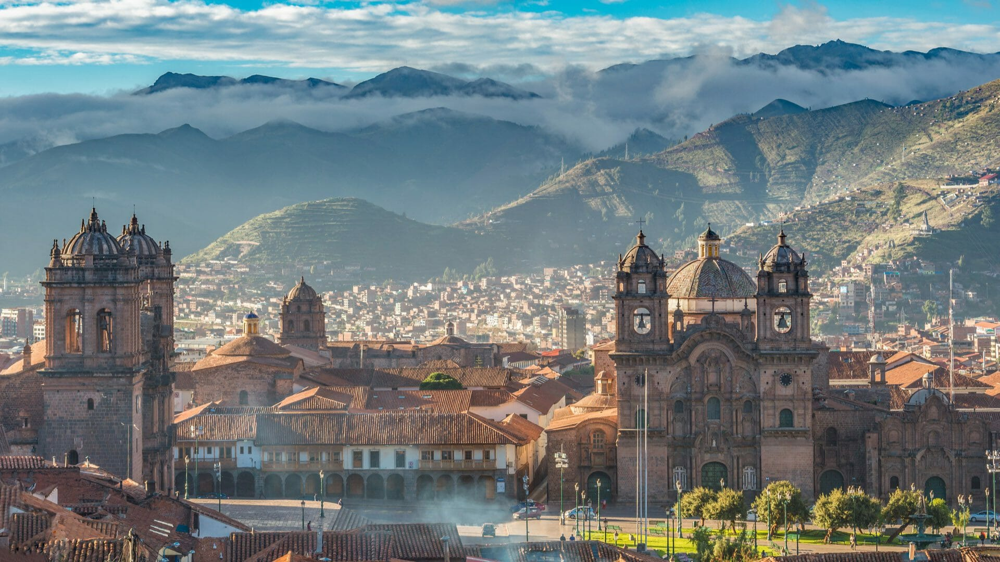

 

¿Te gusta la aventura y mochilear por el mundo? Bueno este itinerario te enamorará, ya que visitaremos lugares simplemente majestuosos  e históricos que nos remontará al pasado. 

## Día 1 - Lima

*Lima es la capital de Perú ubicada en la árida costa del Pacífico del país. Pese a que su centro colonial se conserva, es una desbordante metrópolis y una de las ciudades más grandes de Sudamérica. El Museo Larco alberga una colección de arte precolombino y el Museo de la Nación recorre la historia de las civilizaciones antiguas de Perú.*

**Lugares que puedes visitar:**Museo Larco, Plaza de Armas de Lima, Palacio de Gobierno del Perú, Casa de la Literatura Peruana, Basílica y Convento de San Francisco de Lima, San Cristobal, Museo de Sitio Huaca Pucllana, Indian Market,  Parque Central de Miraflores, Municipalidad de Miraflores, Parque Alfredo Salazar, Beso Francés Crepería, Faro de La Marina en Miraflores, entre otros. 

**Hospedaje:** Costo aproximado por noche para dos personas en un hotel 3 estrellas es de $40 en adelante.

**Desplazamiento:** de Lima a Paracas.
  <ins>Autobús:</ins> El costo es de  $25 en adelante, con una duración de 3:30 horas.

## Día 2 - Paracas

*Paracas es una ciudad de la costa oeste de Perú. Es conocida por sus playas, como El Chaco, ubicada en la bahía resguardada de Paracas. La ciudad es un punto de partida hacia las islas Ballestas deshabitadas, hogar de lobos marinos, pelícanos y pingüinos de Humboldt. La escabrosa Reserva Nacional de Paracas tiene abundante fauna y se extiende por desierto, océano, islas y la península de Paracas.*

**Lugares que puedes visitar:**  Reserva Nacional de Paracas, Bahía de Paracas, Paracas Overland, Huacachina, Área de conservación regional Laguna de Huacachina, entre otros.

**Hospedaje:** Costo aproximado por noche para dos personas en un hotel 3 estrellas es de $40 en adelante.

**Desplazamiento:** de Paracas a Nazca.
  <ins>Autobús:</ins> El costo es de  $11 en adelante, con una duración de 3 horas.  <a href=" https://www.redbus.pe">**Reserva ➡️ AQUí**</a>. 

## Día 3 - Nazca

*Nazca​ es una ciudad peruana capital del distrito homónimo ubicado en la provincia de Nazca en el departamento de Ica. Geográficamente se sitúa en la margen derecha del río Aja, afluente del río Grande en un estrecho valle a 520 m.s.n.m. a 439 km al Sur de Lima.*

**Lugares que puedes visitar:** Acueductos de Cantalloc, Museo Arqueológico Antonini, Puquíos,  vuelo Líneas de nasca, entre otros.
 *🔍El tour de vuelo sobre las líneas de Nazca tiene un costo de $80 + $30 impuestos aeroportuarios, si quieres hacer reserva o tener más información sigue el link  <a href="https://www.peruhop.com/es/vuelo-a-las-lineas-de-nazca/#sobrevuelo-lineas-de-nazca-tour">**AQUí**</a>.*

**Hospedaje:**  Costo aproximado por noche para dos personas en un hotel 3 estrellas es de $45 en adelante.

## Día 4 - Día de viaje
**Desplazamiento:** de Nazca a Paracas.
  <ins>Autobús:</ins> Debemos regresar a Paracas para tomar de ahí el vuelo hacia Cusco. 

**Desplazamiento:** de Paracas a Cusco.
  <ins>Avión:</ins> Aeropuerto **PIO** a **CUZ**, el costo aproximado es de $25 en adelante, con una duración de 1 hora. 
<a href="https://bit.ly/2MZzTIF">**Tiquete aéreo ➡️ AQUÍ**</a>

## Día 5 y 6  - Cusco

*Cuzco es una ciudad de los Andes peruanos que fue la capital del Imperio Inca y es conocida por sus restos arqueológicos y la arquitectura colonial española. La Plaza de Armas es el centro de la ciudad antigua, con galerías, balcones de madera tallada y ruinas de murallas incas.*

**Lugares que puedes visitar:** Moray, Valle Sagrado, Tambomachay, Centro Arqueológico Puka Pukara, Complejo Arqueológico Q'enco, Saqsaywaman, Qurikancha, Montaña de 7 colores, Lago de Humantay, entre otros.

**Hospedaje:**  Costo aproximado por noche para dos personas en un hotel 3 estrellas es de $31 en adelante.

**Desplazamiento:** de Cusco a Aguas Calientes.
  Este es un apartado bastante extenso, por lo que les dejo este articulo <a href="https://laasistentecr.com/-como-visitar-Machu-Picchu/">**¿Cómo visitar Machu Picchu?**</a>,  donde se detalla todo lo que necesitas saber para planaer la visita por tu cuenta y ahorrarse unos cuantos dolares.

## Día 7 - Aguas Calientes (Machu Picchu)

*Aguas Calientes es una ciudad en el valle del río Urubamba en el sureste de Perú. Es conocida por sus baños termales y el acceso a las ruinas incas cercanas de Machu Picchu. El centro de la ciudad está lleno de restaurantes y tiendas, con el Mercado Artesanal en su centro. Al noroeste a lo largo del río, están los Jardines de Mandor con orquídeas y aves.*

**Lugares que puedes visitar:** <a href="https://laasistentecr.com/-como-visitar-Machu-Picchu/">**Machu Picchu**</a> 

**Desplazamiento:**  de Aguas Calientes al Parque de Machu Picchu
  <ins>Bus:</ins> tiene un costo de $24 (ida y vuelta) con una duración de 25 minutos,  <a href="http://consettur.com/">**CONSETTUR**</a> es el único proveedor de servicio de transporte, puedes comprar tu boleto con aterioridad en su pagina oficial <a href="http://consettur.com/reservas/">**Consettur.com**</a>.   También puedes subir caminando el tiempo es de 1 hora aproximadamente, claramente esto puede variar de acuerdo a tu condición física.

Así concluye esta aventura, espero les guste y compartan con todos sus amigos y familiares este artículo. Si quieres siempre estar al tanto de toda esta información de viaje no olvides suscribirte y seguirnos en nuestras redes sociales como <a href="https://www.facebook.com/laasistentecr/" target="_blank">  **La Asistentecr**</a>. 

Desde ya les deseo un buen viaje!

**Atentamente:**
 
La Asistente Cr 
 
Tú asistente de viaje

Fuente: Explorador de viajes de google.

