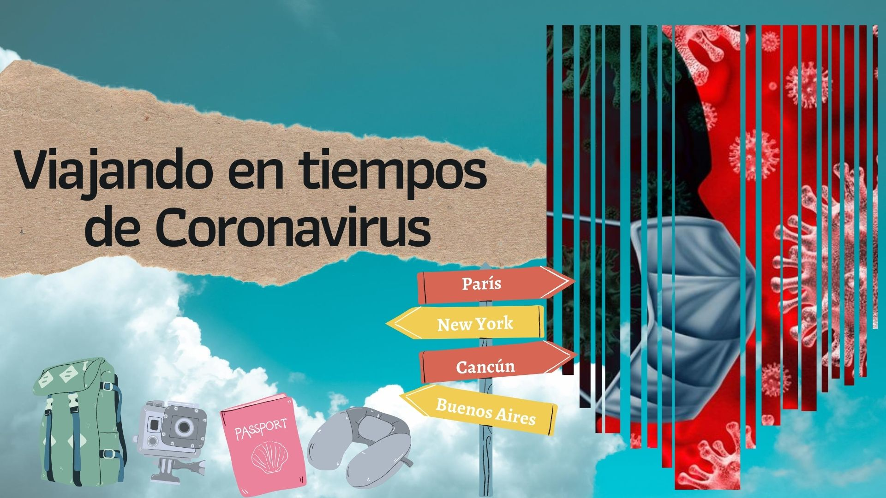
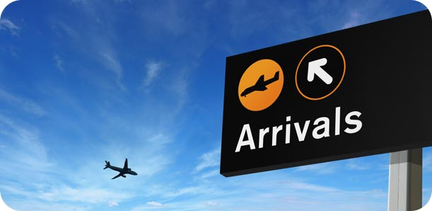

 

El coronavirus llegó para quedarse en nuestras vida y marcar una era del antes y el después del COVID-19. El viajar es algo esencial para la humanidad actual, por la necesidad de desplazarnos con rapidez entre los países ya sea por turismo o trabajo. En una noticia del 04 de mayo del 2019 la ABC publicó que en abril de 2019 se habían podido rastrear un total de 5,5 millones de vuelos. Otro ejemplo fue 2018 que se registraron 12 millones de pasajeros en 120.000 vuelos diarios, según el último informe «Aviation: Benefits Beyond Borders», elaborado por el Air Transport Action Group (ATAG).

El reto ahora es viajar seguros no importa las razones que tengas **trabajo, turismo o porque se vencio tu estadía**,  vas a tener que volver a volar. 

Este artículo es para guiarlos es el proceso para que conozcan que esperar y cómo afrontar esta situación de la mejor manera. Les voy a compartir desde mi experiencia personal, ya que he tenido que hacer dos viajes durante esta pandemia.  
 
#Medidas de Seguridad de las aerolíneas
 
📌 El avión se limpia y desinfecta antes de cada vuelo. 
📌 Uso permanente de las mascarillas de todos abordo. 
📌 Abordando los aviones desde las filas de atrás hacia adelante, o en pequeños grupos. 
📌 Escaneo de temperatura de todos los pasajeros previo abordar. 
📌 Asientos del medio están vacíos. 
📌 No se brinda servicio de alimentos. 
📌 Cada pasajero escanea su pase de abordaje. 
📌 Los aviones de las aerolíneas principales están equipados con filtros de aire HEPA de alta eficiencia para partículas, que purifican el aire. 
 

#Proceso del viaje paso a paso
 

1️⃣ **Check-in**  
La mayoría de las aerolíneas solicitan que se realice el proceso en línea y  lleves tu pase de abordaje impreso desde tu casa. Lo ideal es que solo lleves una maleta tipo “carry on”, pero si debes llevar una maletas chequeadas solo deberás hacer fila para entregarla y así realizar el proceso  ágil.  Durante el proceso de check-in o entrega de la maleta siempre mantendrás la distancia de los 6 pies y usando la máscara. 

2️⃣ **Espera para abordaje** 
Como sabemos siempre debemos hacer una larga espera antes de abordar, evita esta tocando las superficies, trata de estar constantemente lavando o desinfectando tus manos y no te toques la cara. La mayoría de las aerolíneas no están ofreciendo alimentos a bordo. Por lo que te recomiendo comprar antes de viajar en el supermercado lo que te guste semillas, snacks, chicles, chocolates, galletas, etc y si no tuviste tiempo de igualmente lo puedes comprar en el aeropuerto, ya que de igualmente debes comprar ahí el agua o bebidas para el viaje.  Eso sí les recomiendo no tomar mucho líquido antes del vuelo, para evitar el uso de baño del avión. 

3️⃣ **Abordaje**  
Algunas aerolíneas han realizado una manera lógica para abordar, ya sea en grupos pequeños de diez personas, otras abordan primero las personas que están sentado en las últimas filas hacia adelante y otros simplemente por zonas solicitando que se mantenga el distanciamiento social. Si estás en el último de los escenarios mi recomendación es que esperes a ser el último para abordar así todos van a estar en sus asientos y nadie te va obstaculizar el paso, evitando el contacto con otros pasajeros.

Algunas aerolíneas están tomando la temperatura en el abordaje, entonce si el termómetro registra 100.4°F/ 38°C o superior no puedes volar ni tampoco el grupo de personas que viaja contigo.

4️⃣ **Vuelo** 
Esta es la parte más común cada quien toma su asiento y sin dejar de portar su mascarilla disfruta el vuelo. Las aerolíneas de bajo costo no están sirviendo ningún tipo de alimento a bordo, mientras otras como jetblue entregan a los pasajeros una bolsa previamente sellada y bien desinfectada con snack, agua y servilletas.
Si deseas ir al baño no hay problema, solo debes saber que se puede hacer fila solo una persona puede estar de pie esperando que salga la que se encuentra en el baño.

5️⃣ **Arribo** 
Una vez que se aterriza al aeropuerto y el avión ya se encuentra en el hangar (detenidos), nadie se puede levantar a sacar su maleta de mano rapidamente (creo que asi deberia ser siempre), sino que los que se encuentran en la primera fila se levantan sacan su maleta y salen y así sucesivamente hasta el fondo del avión. De esta manera se mantiene el orden y evitamos el contacto con los demás. El aeropuerto vas hacer el proceso de migración y demás con la distancia requerida y sin dejar de portar tu mascarilla.
 
  

No debes temer, lo cierto es que vivimos en un gran ecosistema donde sin percatarnos podemos contraer el virus en el lugar o situación menos esperada; la clave es siempre estar consciente de la limpieza de tus manos, no llevarlas a tu cara y portar tu mascarilla. Espero este artículo los guie y tranquilice en el proceso que se lleva a cabo antes, durante y después del vuelo. 

Me gustaría saber si les gustó o si fue de utilidad esta información dejando un comentario abajo. Recuerde si quieres siempre estar al tanto de toda esta información de viaje no olvides suscribirte y seguirnos en nuestras redes sociales como  <a href="https://www.facebook.com/laasistentecr/" target="_blank">  **La Asistentecr**</a>.

Desde ya les deseo un buen viaje!

**Atentamente:**
 
La Asistente Cr 
 
Tú asistente de viaje

