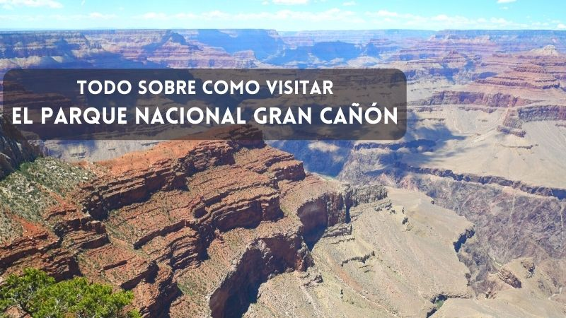
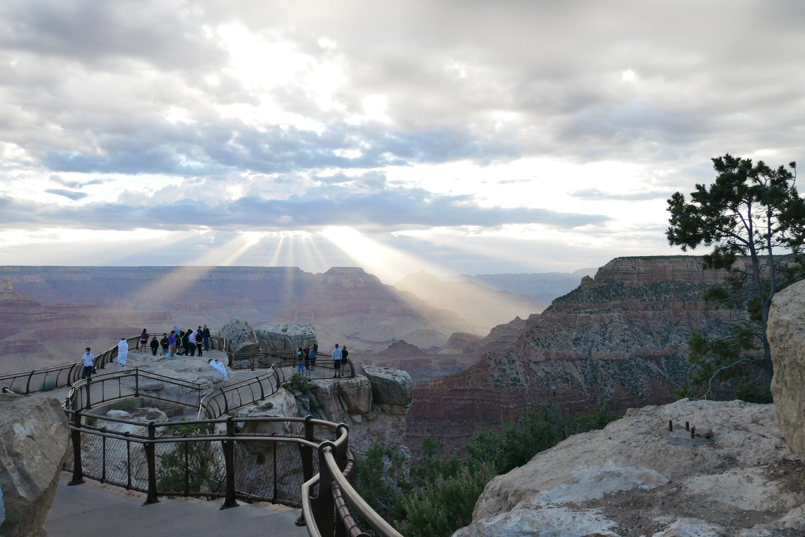

La naturaleza es de las cosas más majestuosas que podemos disfrutar en un viaje, es por eso que hace un tiempo planeé este viaje al Gran Cañón y hasta el día de hoy creo que ha sido de lo más alucinante que han visto mis ojos. Así que espero tengan la oportunidad de visitar este parque nacional. 

Antes de iniciar con todos los detalles para visitar el Gran Cañón, les comento que el aeropuerto internacional más cercano es Phoenix, Arizona; sin embargo los tiquetes aéreos suelen ser más baratos si viajas al aeropuerto de Las Vegas, Nevada. 

# 1. ¿Cómo llegar? 
Nosotros decidimos que la mejor manera para poderlo disfrutar al cien por ciento es rentando un vehículo, también puedes pagar tours desde Las Vegas hasta el parque, pero recuerda las limitantes de los tour y el costo, no obstante es tu decicion.  
En nuestro caso, como les comentaba rentamos un vehículo una vez que sales del aeropuerto de Las Vegas sigues la rotulación donde te vas a encontrar con un servicio de bus que te lleva a una central donde están todas las empresas de rent a car. Ahí haces el proceso para retirar el vehículo y en menos de 30 minutos ya estás listo para iniciar la aventura. Para movernos con facilidad nosotros utilizamos google maps, colocas la dirección y listo. 

# 2. Sobre el Gran Cañón

El Gran Cañón se divide en 4 secciones por decirlo de alguna manera, está el norte y sur que son administrados por el gobierno (National Park Services), el oeste lo administra la tribu Hualapai y el este los indios Navaja. Entonces debes entender que las reglas y costos van a variar de acuerdo a esto.

¿Qué fechas lo puedes visitar? Bueno lo ideal es que no sea ni invierno ni verano, recuerda que estamos cerca del desierto de Arizona, por tanto las temperaturas suelen ser bastante extremas. Adicionalmente, para el  invierno algunas de las rutas no están abiertas.

El clima puede ser inesperado por lo que te sugiero andar preparado, tanto para el calor como el frío.

# 3. Atracciones 

La lista es infinita y todo de acuerdo a tus gustos y preferencias. Porque puedes hacer rafting, vuelo en helicóptero, paseo en mulas, trails hasta el río,  en fin muchas actividades. Por lo que lo voy a limitar a las básicas y más visitadas  de cada borde del parque.

<a href="https://grandcanyonwest.com/" target="_blank">**Borde Oeste (Tribu Hualapai)**</a>

Skywalk  
Havasu Falls

<a href="https://navajonationparks.org/guided-tour-operators/antelope-canyon-tour-operators/" target="_blank">**Borde Este (Indios Navajo)**</a>

Antílope cañón   
Puente Navajo   
Curva de la Herradura   

<a href="https://www.nps.gov/grca/planyourvisit/basicinfo.htm#CP_JUMP_2627738" target="_blank">**Borde Norte**</a>

Bright Angel Point   
North Rim Visitor Center   
Coconino Overlook   
North Kaibab Trail   
Roaring Springs Canyon   

<a href="https://www.nps.gov/grca/planyourvisit/basicinfo.htm#CP_JUMP_2627738" target="_blank">**Borde Sur**</a>

Mather Point   
Hopi Point   
Yaki point   
Mohave Point   
Maricopa Point   
Rim Trial   
Torre de Vigilancia Desert View   
Grand Canyon Village   
Grand Canyon Railway   

# 4. Mi Ruta visitando el Borde Sur (South Rim)

Les contaré los detalles de cómo fue que yo visite el parque. En mi caso solo tuve la oportunidad de visitar el borde sur, ya que por la pandemia los demás bordes se encontraban cerrados.  Así que iré hablando sobre mi experiencia y agregando información que les pueda ayudar para que ustedes puedan decidir cómo planear su viaje. Sin más preámbulo iniciemos.

Nosotros partimos de Las Vegas para un pueblito que se llama Valle, Arizona donde encontré un muy bonito lugar que se llama Grand Canyon Inn & Motel, al lado teníamos un super y una gasolinera. 

**Hospedaje:** En el borde sur del Gran Cañón hay hospedaje para todos los gustos y presupuestos. Puedes acampar dentro del parque, ya que hay zonas específicas para hacerlo. También encontrarás hoteles dentro del parque, que por lo general tiene precios intermedio y otros un poco altos, todo depende de la fecha que visites el lugar. La tercera opción sería hospedarse en Tusayan, que es una ciudad super cerca de la entrada del parque. En este lugar puedes encontrar una variedad de precios, pero te recomiendo que lo planees con tiempo para que no te quedes sin espacio como me pasó a mí. Esto me lleva a la siguiente opción, que sería hospedarse en Valle que se ubica a unos 30 minutos del parque. La última opción y la que no recomiendo es hospedarse en Williams, ya que está a una hora del parque. Lo bueno es que como experiencia podrías tomar el tren que sale de ahí hacia Grand Canyon Village con una duración de 2 horas. 

Siguiendo con el viaje, al día siguiente partimos para el Gran Cañón la entrada al parque tiene un costo de 35 dólares por vehículo (con capacidad de hasta 15 personas) y es válida por siete días, la puedes comprar en línea  <a href="https://www.recreation.gov/sitepass/74282. " target="_blank">**AQUÍ**</a> o en el lugar.  Te recomiendo en línea para que sea más rápido el ingreso y hablando de ingreso, te sugiero llegues temprano porque la filas se hace bastante larga.

Además que lo que NO puedes pero JAMÁS dejar de hacer es, ver el amanecer en el mather point y un atardecer en Yaki point. Así que revisa en google a que hora amanece para la fecha en específico que vas a visitar y levántate temprano. Las ventajas es que casi no hay personas a esa hora y disfrutas un montón la mañana para recorrer el parque. Luego para el atardecer, una o dos horas antes busca tu espacio donde nadie te obstruya la vista. Lleva snacks, bebidas y un buen abrigo para esperar el atardecer y te aseguro que nunca te vas arrepentir de la espera.

Para recorrer el borde sur se requiere al menos dos días les voy a dejar los mapas para que planeen los puntos y los trails que quieran visitar <a href="https://www.nps.gov/grca/learn/news/newspaper.htm#CP_JUMP_839064" target="_blank">**Página de guías**</a>  

<a href="https://www.nps.gov/grca/learn/news/upload/sr-pocket-map.pdf" target="_blank">**Mapa del borde sur**</a>  

<a href="https://www.nps.gov/grca/learn/news/upload/nr-pocket-map.pdf" target="_blank">**Mapa del borde norte**</a>

Para visitar los diferentes puntos, puedes hacerlo en tu vehículo, bicicleta (se puede rentar), caminando y bus (servicio gratuito).

Si deseas saber como funciona el servicio de bus te dejo acá el link <a href="https://www.nps.gov/grca/planyourvisit/shuttle-buses.htm" target="_blank">**Servicio de bus**</a> .

De manera resumida, les comento que las rutas están marcadas en los mapas por colores así te guías para saber que bus debes abordar de acuerdo los puntos que quieras visitar. 

Village Route (azul) 
Kaibab Rim Route (naranja)
Hermit Road Route (rojo) 
Tusayan Park & Ride (morado)
Hiker Express Shuttle

Luego de muchas fotos del amanecer en el mather point, iniciamos la caminata desde ahí a Yavapai Point que son 1.1km aproximadamente.

Por la pandemia no había servicio de autobús, por lo que nos devolvimos caminando al parqueo, luego decidimos tomar una merienda para posteriormente iniciar el recorrido de los diferentes puntos hasta llegar al Desert View.

Después del recorrido nos fuimos a tomar un café para calentarnos un poco, ya que el frío estaba intenso a pesar de que estábamos en verano. Finalmente, nos fuimos a buscar un buen lugar donde poder ver el atardecer.

El segundo día, nos levantamos un poquito más tarde e iniciamos a las 8am para  visitar Hermit Road, ya que debimos hacerlo caminando. Llegamos a la mitad del trail porque se nos acabó el agua y no hay donde puedas rellenar la botella, así que lleva bastante, además que el calor de julio en el Gran Cañón nos abrazó con toda su fuerza. Ascendiendo duramos 3 horas porque íbamos deteniendonos para tomar fotos y para el regreso tardamos 1 hora y media a un buen paso y sin detenernos. 

Dato importante es que en tiempo normal está la posibilidad de que subas a los buses para devolverte o subir a los diferentes puntos lo que lo hace bastante más sencillo y agradable. En nuestro caso los servicios no estaban funcionando por la pandemia.

Cuando llegamos tomamos un buen descanso para refrescarnos y un helado para bajar el calor. Posteriormente, volvimos al hotel y descansamos. Como era 4 de julio nos fuimos a cenar a la hermosa ciudad de Williams, ordenamos unas deliciosas hamburguesas y de fondo la música country creaba una ambiente genial. Finalmente, terminando el viaje a Gran Cañón con fuegos artificiales. ¡Happy birthday America! 

Me gustaría saber si les gustó o si fue de utilidad esta información dejando un comentario abajo. Recuerde si quieres siempre estar al tanto de toda esta información de viaje no olvides suscribirte y seguirnos en nuestras redes sociales como  <a href="https://www.facebook.com/laasistentecr/" target="_blank">  **La Asistentecr**</a>.

Desde ya les deseo un buen viaje!

**Atentamente:**
 
La Asistente Cr 
 
Tú asistente de viaje

